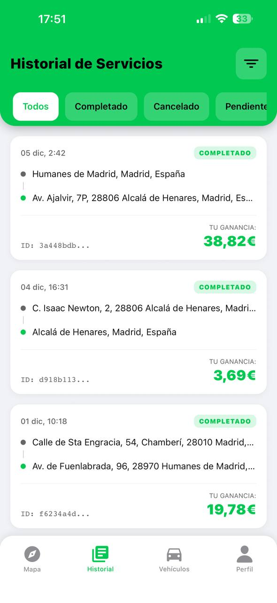

# 📦 Pickmu — Mobile Frontend Application

**Role:** Mobile Frontend Engineer  
**Platform:** iOS & Android  
**Status:** Production-ready / Field-tested  
**Repository Type:** Mobile Client (React Native)

---

## 🔍 Why This Project Matters

Pickmu is **not a demo or academic project**.  
It is a **production-grade mobile application** designed for real-world logistics, where **real-time location accuracy, background execution, and battery efficiency** are business-critical.

This project demonstrates my ability to **design, build, and ship complex mobile systems** under real operational constraints.

---

## 🚀 Project Overview

**Pickmu** is a mobile delivery platform that connects individuals and businesses with nearby riders to perform **on-demand and scheduled services** (food delivery, package pickup, express shipments, etc.).

This repository contains the **entire mobile frontend** of the application, covering **both User and Rider experiences**, built from scratch using **React Native with Expo**.

### My responsibilities included:

- Full mobile frontend architecture and implementation (~40+ screens)
- Design and implementation of a real-time, battery-efficient GPS tracking system
- Integration with multiple backend services and async data flows
- State management for complex multi-role application logic
- CI/CD ownership using Expo Application Services (EAS)
- Production builds and store deployment (App Store & Google Play)

A key technical challenge — and the main differentiator of this project — was the design of a **high-performance real-time rider tracking system** suitable for continuous, real-world logistics usage.

---

## 🖥️ Aplicación en producción

La aplicación **Pickmu** está actualmente **en uso real por la empresa** para operaciones logísticas.  
Se trata de la versión final de la app, disponible para descarga en **Apple App Store** y **Google Play Store**, incluyendo todos los flujos de usuario y repartidor.

Esto permite evaluar directamente la **experiencia de usuario, el rastreo en tiempo real, la gestión de pedidos y todas las funcionalidades de producción**, demostrando el impacto real de este proyecto.

> Nota: Esta sección está destinada a la evaluación técnica del frontend. No se requiere acceso a datos sensibles de clientes para explorar la aplicación.

---

## 🧱 Tech Stack

### Core Technologies
- React Native
- TypeScript
- Expo & EAS

### State & Navigation
- React Navigation
- Context API / Redux

### Platform & Services
- Geolocation & Maps APIs
- Expo Background Tasks
- Push Notifications (EAS)

---

## 📱 Application Structure

The app is divided into two main operational flows.

### 👤 User Application
Authentication, onboarding, service requests, real-time tracking, order history, wallet & transactions, document uploads, profile & settings.

### 🏍️ Rider Application
Rider onboarding, active & pending services, real-time tracking, chat, wallet & earnings, service history, vehicle & document management.

---

## ✨ Key Features

- **Fully Adaptive UI**  
  Responsive layouts across a wide range of Android and iOS devices.

- **Advanced Real-Time Geolocation**  
  Live rider and order tracking with map visualization.

- **Battery-Efficient GPS Architecture**  
  Custom dual-mode tracking system designed for production logistics usage.

- **Multi-Provider Authentication**  
  Email, Google, and Apple authentication under a unified auth flow.

- **Real-Time Chat**  
  Rider ↔ User ↔ Support communication.

- **Wallet & Transactions**  
  Balance management, top-ups, and transaction history.

- **Push Notifications**  
  Order updates, chat messages, and system alerts via EAS.

- **Secure File Uploads**  
  Identity and vehicle document handling.

---

## 🧠 Technical Deep Dive — High-Performance GPS Engineering

Continuous rider tracking — including background execution — is a **mission-critical component** of Pickmu.  
The system was designed to balance **accuracy, OS limitations, network usage, and battery consumption**.

### Background Location Persistence

- Implemented Expo Background Tasks using `LOCATION_TASK_NAME`
- Ensures GPS tracking continues when the app is backgrounded
- Session state persistence prevents OS task termination
- Supports reliable tracking on both iOS and Android

### Dual-Mode Geolocation Strategy

To minimize battery drain without sacrificing accuracy:

- **IDLE Mode**
  - Low-frequency updates
  - Reduced precision
  - Used when rider is inactive or waiting

- **ACTIVE Mode**
  - High-precision tracking
  - Enabled only during active deliveries

### Network & Battery Optimization (Batching)

- GPS updates are queued locally
- Up to **3 location points** are sent in a **single request every 5 seconds**
- Significantly reduces battery usage, network overhead, and backend load

---

## ⚙️ Build, Deployment & CI/CD

- Managed the complete EAS workflow
- Custom development builds for advanced debugging
- Production builds for:
  - Apple App Store
  - Google Play Store
- Platform-specific background execution validation
- Strict iOS background testing using dev-client builds

---

## 🧪 Testing Strategy

Due to the nature of mobile background services and time constraints, automated testing is currently limited.

The project focuses on:
- Real-device field testing
- Background execution stress tests
- Battery consumption analysis
- Network instability scenarios

**Planned improvements:**
- Unit tests for business logic
- Integration tests for critical application flows

---

## 🧪 Real-World Testing & Validation

The application was tested during **live field operations**, including real delivery routes and production-like usage.

The screenshots below are **real production captures**, provided by the Pickmu team during testing phases.

  
  
  
   
  <small><i>Login · User Home · Package Details</i></small>

  
  
  
   
  <small><i>Address Selection · Real-Time Tracking · Order History</i></small>

  
  
  
   
  <small><i>Rider Home · Rider Service Request · Rider In-Service</i></small>

  
   
  <small><i>Rider History</i></small>

---

## 🧩 Challenges & Solutions

| Challenge | Solution |
|--------|---------|
| Background GPS reliability | Expo Background Tasks + session persistence |
| Battery drain | Dual-mode tracking (IDLE / ACTIVE) |
| Multi-provider authentication | Unified auth logic via Context / Redux |
| Adaptive UI | Responsive layouts and dynamic styling |
| Push notifications | EAS integration with cross-platform testing |
| iOS background testing | Dev-client builds and strict install flow |

---

## ⚠️ Notes

This repository contains the **frontend implementation only**.  
Sensitive backend logic and infrastructure are intentionally excluded.

---

## 🤝 Acknowledgements

Special thanks to **Fernando** (Pickmu CTO) for collaboration on API design, debugging, and backend integration.

---

## 👤 Author

**Jolmo**  
Mobile Frontend Engineer

- Focused on high-performance mobile systems
- Strong experience with real-time geolocation & background execution
- Interested in large-scale consumer and logistics products

- 🌐 Portfolio: https://your-portfolio-link
- 💻 GitHub: https://github.com/your-username
- 💼 LinkedIn: https://linkedin.com/in/your-profile
