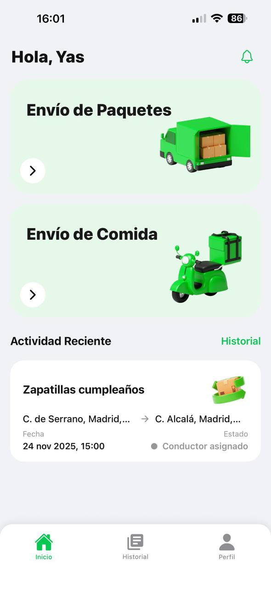
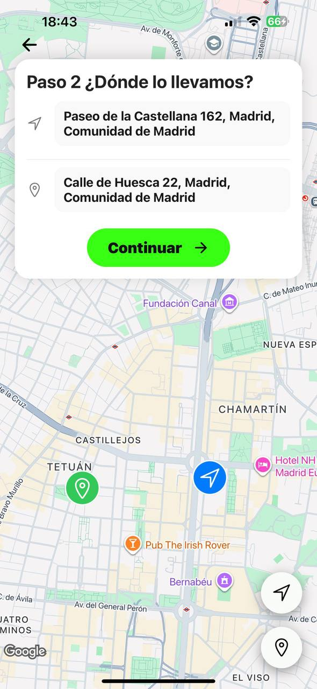
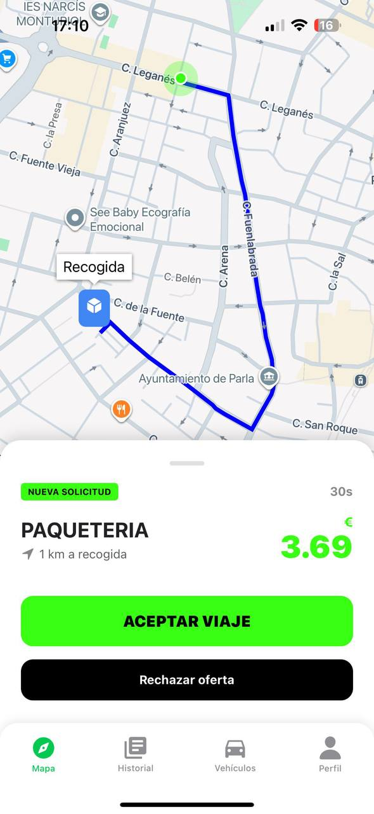
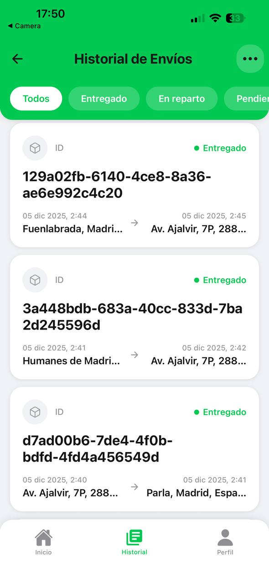
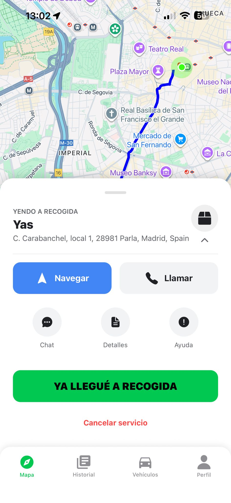

# 📦 Pickmu — Mobile Frontend Application

**Role:** Mobile Frontend Engineer  
**Platform:** iOS & Android  
**Status:** Production-ready / Field-tested  
**Repository Type:** Mobile Client (React Native)

---

## 🚀 Project Overview

**Pickmu** is a mobile delivery platform that connects individuals and businesses with nearby riders to perform on-demand and scheduled services (food delivery, package pickup, express shipments, etc.).

This repository contains the **entire mobile frontend** of the application, covering **both User and Rider experiences**, built from scratch using **React Native with Expo**.

My responsibility encompassed:

- Full mobile frontend architecture and implementation  
- Advanced real-time geolocation & GPS engineering  
- API integration and state management  
- CI/CD via Expo Application Services (EAS)  
- Production builds and store deployment (App Store & Google Play)

A core technical challenge — and the main differentiator of this project — was the design of a **high-performance, battery-efficient real-time rider tracking system**, suitable for real-world logistics usage.

---

## 🧱 Tech Stack

- React Native  
- Expo & EAS  
- TypeScript  
- React Navigation  
- Context API / Redux  
- Geolocation & Maps APIs  
- Expo Background Tasks  
- Push Notifications (EAS)  

---

## 📱 Application Structure

The app is divided into two main operational flows:

### 👤 User Application

Users can request services, track orders in real time, manage their profile and wallet, upload documents, and communicate with riders.

**Key Screens:**
- Authentication (Login, Register, Phone Verification, Password Recovery)
- Onboarding & Intro flows
- Home Dashboard
- Multi-step Service Request (Onboarding Flow)
- Real-time Order Tracking
- Order History
- Profile & Settings
- Wallet & Transactions
- Document Upload
- Legal & Configuration screens

---

### 🏍️ Rider Application

Riders manage deliveries, track active services, communicate with users/support, and handle vehicle and identity verification.

**Key Screens:**
- Rider Home (Active & Pending Services)
- Rider Onboarding
- Profile & Vehicle Management
- Document Upload & Verification
- Real-time Chat
- Wallet & Earnings
- Service History
- Settings & Configuration

---

## ✨ Key Features

- **Fully Adaptive UI**  
  Responsive layouts across a wide range of Android and iOS devices.

- **Advanced Real-Time Geolocation**  
  Live tracking of riders and orders with map visualization.

- **Battery-Efficient GPS Architecture**  
  Custom-designed dual-mode tracking system for production logistics usage.

- **Multi-Provider Authentication**  
  Email, Google, and Apple authentication flows unified under a single state system.

- **Real-Time Chat**  
  Rider ↔ User ↔ Support communication via Webhooks.

- **Wallet & Transactions**  
  Balance management, top-ups, and transaction history.

- **Push Notifications**  
  Order updates, chat messages, and system alerts via EAS.

- **Secure File Uploads**  
  Identity documents, vehicle documents, and images.

---

## 🧠 Technical Deep Dive — High-Performance GPS Engineering

A mission-critical component of Pickmu is **continuous rider tracking**, even when the app is backgrounded — without destroying battery life.

### Background Location Persistence

- Implemented Expo Background Tasks using `LOCATION_TASK_NAME`
- Ensures GPS tracking continues when the app is minimized or backgrounded
- Preserves session state (auth token) to prevent OS task termination
- Critical for logistics reliability on both iOS and Android

### Dual-Mode Geolocation Strategy

To balance precision and battery consumption:

- **IDLE Mode**
  - Low-frequency updates
  - Minimal GPS precision
  - Used when rider is waiting or inactive

- **ACTIVE Mode**
  - High-precision tracking
  - Enabled only during active deliveries

This approach dramatically reduces unnecessary battery drain while maintaining real-time accuracy when it matters.

### Network & Battery Optimization (Batching)

- Implemented a location batching system
- GPS updates are queued (`updatesQueue`)
- Up to **3 location points** are sent in a **single request every 5 seconds**
- Reduces network overhead, battery usage, and backend load

---

## ⚙️ Build, Deployment & CI/CD

- Managed the entire EAS workflow
- Custom development builds for advanced debugging
- Production builds for:
  - Apple App Store
  - Google Play Store
- Ensured compatibility with background services and platform-specific requirements
- Strict testing flow for iOS background geolocation using dev-client builds

---

## 🧪 Real-World Testing & Validation

The UI and tracking system were tested during **live field operations**, including:

- Real delivery routes
- Background execution stress tests
- Battery consumption analysis
- Network instability scenarios

The screenshots below are **real production captures**, provided by the Pickmu team during testing phases.

  
  
  
   
  <small><i>Login · User Home · Location Selection</i></small>

  
  
  
   
  <small><i>Real-Time Tracking · Order History · Rider Home</i></small>

  
  
  
   
  <small><i>Rider Service · Active Order · Rider History</i></small>

---

## 🧩 Challenges & Solutions

| Challenge | Solution |
|--------|---------|
| Background GPS reliability | Expo Background Tasks + session persistence |
| Battery drain | Dual-mode tracking (IDLE / ACTIVE) |
| Multi-provider authentication | Unified auth logic via Context/Redux |
| Adaptive UI issues | Responsive layouts and dynamic styling |
| Push notifications | EAS integration with cross-platform testing |
| iOS background testing | Dev-client builds + strict install flow |

---

## 🤝 Acknowledgements

Special thanks to **Fernando** (PickMu's CTO) for support with API design, debugging, and backend integration, which significantly streamlined frontend development.

---

## 👤 Author

**Jolmo**  
Mobile Frontend Engineer

- 🌐 Portfolio: *(add link)*
- 💻 GitHub: *(add link)*
